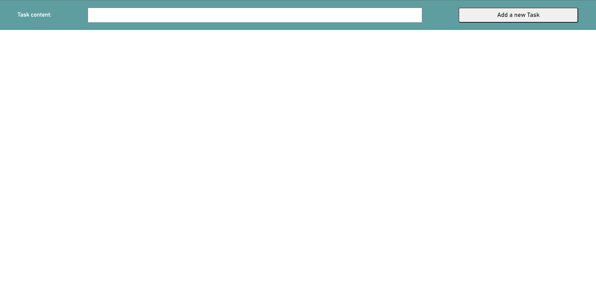
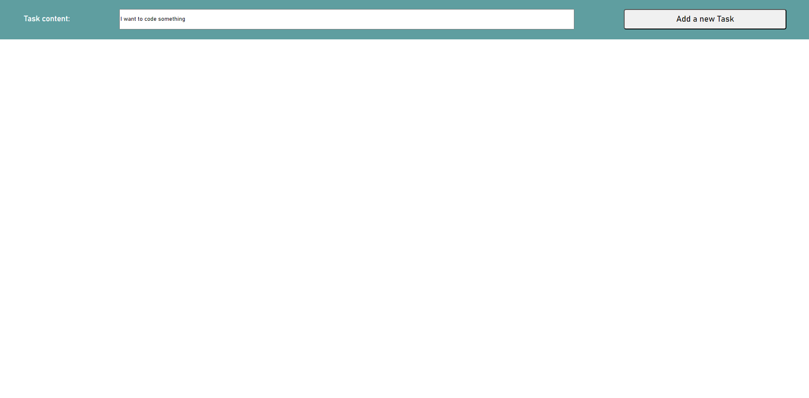
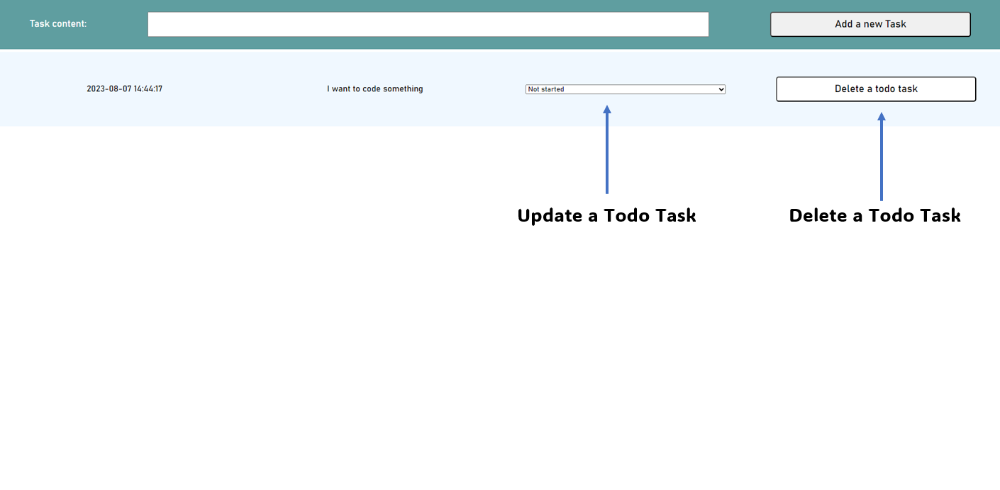

# TODO App based on the Domain Driven Design (DDD) - Onion architecture 

## Techstack :

- Python and Flask 
- Sqlite
- Javascript
- Html
- CSS
- Jinja

## The backend - API documentation

### Add a new Todo Task to the database

```Http
POST http://127.0.0.1:5000/todos
Content-Type: application/json
```

```json
{
    "content": "I want to go the school",
    "status": "Not started"
}
```

### Get all Todo Tasks from the database

```Http
GET http://127.0.0.1:5000/todos
Accept: application/json
```

```json
[
  {
    "content": "I want to play some chess",
    "created_at": "2023-08-04 08:13:14",
    "id": 1,
    "status": "Not started"
  },
  {
    "content": "I want to drink some coffee",
    "created_at": "2023-08-04 08:21:49",
    "id": 2,
    "status": "Not started"
  },
  {
    "content": "I have to do some sport",
    "created_at": "2023-08-04 08:22:25",
    "id": 3,
    "status": "Not started"
  },
  {
    "content": "I want to go the school",
    "created_at": "2023-08-04 08:47:36",
    "id": 4,
    "status": "Not started"
  }
]
```

### Modify the status of a Todo Task

```Http
PUT http://127.0.0.1:5000/todos/1
Content-Type: application/json
```

```json
{
  "status": "In Progress"
}
```

### Delete a Todo Task from the database

```Http
DELETE http://127.0.0.1:5000/todos
Content-Type: application/json
```
```json
{
    "id": 1
}
```

## The frontend 

The start of the application:



Press the "Add a new Task" button to add a todo task:



Use the combobox to update the todo task from:

- Not started

into: 

- In Progress 
- Done



or if you want to delete the todo task, just press the "Delete a todo task" button

## What is missing:

- validation 
- Exceptions

## How to install it: 

Just run:

````
    pip install -r requirements.txt
````